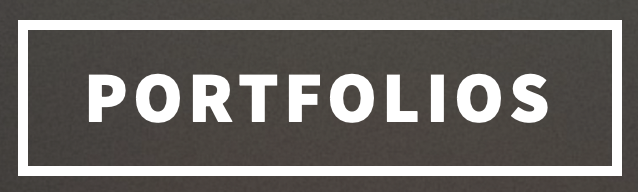

  

---

# Javlonbek Ismonov |   

### Financial Risk and Data Analysis Student  

Hi there! I'm a passionate **Financial Risk and Data Analysis Student** currently studying at **Sapienza University of Rome**. I enjoy combining my skills in finance and data science to solve complex challenges and uncover actionable insights.

---

## 🌟 Areas of Expertise:
- 📈 Financial Analysis  
- 📊 Data Visualization and Modeling  
- 🤖 Machine Learning and AI in Finance  
- 🧮 Statistical Analysis for Decision-Making  

---

         

---

## 🌐 Connect with Me:
- 💼 [LinkedIn](https://www.linkedin.com/in/javlonbek-ismonov-a995b2209)  
- 📂 [Portfolio](https://javlon001.github.io)  

### Highlights:
🚀 Erasmus+ Alum, University of Bern  
📚 Master's in Financial Risk and Data Analysis  
💡 Enthusiastic about applying AI to bridge economic gaps globally  

- ⚡ Fun fact: I love listening to white noise while working on something serious!

---

### 🔝 Top Contributed Repo

---

